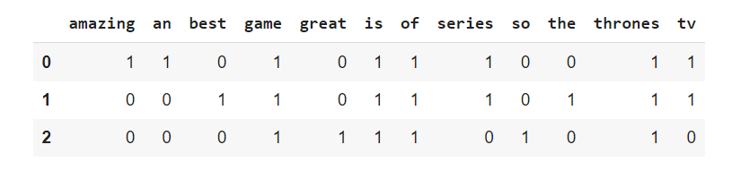

## What is a Bag of Words in NLP?
Bag of words is a Natural Language Processing technique of text modelling. In technical terms, we can say that it is a method of feature extraction with text data. This approach is a simple and flexible way of extracting features from documents.

A bag of words is a representation of text that describes the occurrence of words within a document. We just keep track of word counts and disregard the grammatical details and the word order. It is called a “bag” of words because any information about the order or structure of words in the document is discarded. The model is only concerned with whether known words occur in the document, not where in the document.

## Why is the Bag-of-Words algorithm used?
So, why bag-of-words, what is wrong with the simple and easy text?  

One of the biggest problems with text is that it is messy and unstructured, and machine learning algorithms prefer structured, well defined fixed-length inputs and by using the Bag-of-Words technique we can convert variable-length texts into a fixed-length vector.

Also, at a much granular level, the machine learning models work with numerical data rather than textual data. So to be more specific, by using the bag-of-words (BoW) technique, we convert a text into its equivalent vector of numbers.

# A Quick Example
Let’s look at an easy example to understand the concepts previously explained. We could be interested in analyzing the reviews about Game of Thrones:

    Review 1: Game of Thrones is an amazing tv series!
    
    Review 2: Game of Thrones is the best tv series!
    
    Review 3: Game of Thrones is so great

In the table, I show all the calculations to obtain the Bag-Of-Words approach:

Bag-of-Words with Python  example

Each row corresponds to a different review, while the rows are the unique words, contained in the three documents.